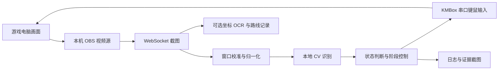

# OBS + CV + KMBox：项目交接与操作说明

新会话先看 [START_HERE.md](START_HERE.md)：固定设备拓扑、现场检查顺序、无代码参数操作与最新任务入口。

> **钓鱼实测更新（2026-09-28）：** 当前湖边视角已完成连续 10 次收鱼，独立有界脚本、截图证据与适用范围见 [钓鱼实测说明](FISHING_TRIAL.md)。此结果不等于统一运行器的全部实机验收。

> **2026-09-28 架构更新：** 新命令入口已接入统一运行器，详见 [架构实现与验收记录](ARCHITECTURE_IMPLEMENTATION.md)。下文保留原系统交接快照；其中子进程编排、停止时机和日志路径不再适用于新入口。新运行器已做离线回归，完整实机验收尚未完成，未验收功能默认关闭。

后续开发遵循架构文档中的“开发原则：避免过度设计”：以最少必要改动解决实际问题，优先复用和验证现有实现，保留取消、误售防护与结果证据等必要边界。

更新日期：2026-09-28。本文根据当前源码、标定文件和本地实验记录整理，供后续开发者、规划者及新的程序助手快速接手。本文编写期间仅做源码检查和离线测试，没有启动游戏控制、连接 OBS 或发送硬件输入。

## 1. 项目背景与最终目标

用户希望逐步实现：**自动打怪 → 拾取尸体物品 → 背包容量不足时回城出售 → 返回打怪区域 → 继续循环**。优先由本地 CV 和控制脚本完成动作及阶段切换，尽量减少 ChatGPT/Codex 在常规运行中的介入。模型主要用于初次标定、代码修改、规划和异常复核。

当前已实现打怪、回蓝、拾取、剥皮、固定可见背包检查、满包停止及有限巡游，允许目标已扩展到已标定的狼、石腭怪和小型峭壁野猪。窗口整体移动/等比例缩放可自动归一化，但仍依赖原有 UI 内部布局。**商人路线与交互已有实验代码，实际出售、完整往返循环及矿石采集仍未验收成功。**

用户后续指定满包时前往杂货商坐标 **(30.1,71.6)**，返回 **(24.2,73.6)** 附近；出售失败后继续只打怪、不拾取。剥皮和采矿可尝试，失败跳过。出售范围暂按只卖灰色杂物准备，保留装备、采集材料、任务物品和未知物品；代码尚未执行任何售卖。

### 最新运行记录快照

截至本次文档核对，`runs/patrol-hunt-07/status.json` 已为 `STOPPED`：第 4 轮 `no_damage_in_combat`，背包前置读数 6 空位，未尝试商人路线。前 3 轮为 `no_targets_found` 后继续巡游，并非击杀成功；第 4 轮恢复结果为 `ESCAPE_LIMIT`，末次读数生命约 67.6%、战斗提示关闭。它没有满足 `ESCAPED` 所需的连续三次脱战确认，不能写成稳定逃脱成功。这是保存的运行记录，不是本次实时游戏观测。

此前 `patrol-hunt-05` 曾发生战斗恢复失败和角色死亡；后续完成复活并继续实验，但没有自动复活循环。不能仅凭窗口校准通过或进程退出码为 0 宣称无人值守运行可靠。

程序读取 OBS 截图并发送外部键鼠输入，不读取游戏内存，不注入游戏代码。画面经过本地 OpenCV/Apple Vision 处理；获取 OBS 截图不等于调用模型。

## 2. 当前能力与证据

| 功能 | 当前状态 | 可追溯证据及边界 |
|---|---|---|
| 寻怪、转向、接近、攻击 | 已有多次实机记录 | `runs/session-20260927-163235.jsonl`；目标白名单含已标定狼、石腭怪、小型峭壁野猪，见 `calibration/profile.json` |
| 脱战原地回蓝后继续打怪 | 已完成一次完整实测 | `runs/mana-live-summary.json`；记录一次完整回蓝周期及 4 次经验提示 |
| 打怪与拾取连续串联 | 已有三轮成功记录 | `runs/hunt-loot-multi-01/summary.json`、`metrics.json`；不等于长期稳定性验收 |
| 背包识别及关闭确认 | 已实测 | `runs/bag-check-01/result.json`、`runs/bag-after-loot-live-03/result.json` |
| 容量不足停止拉怪 | 已实测 | `runs/bag-gate-live-01/summary.json`；阈值实验触发 `NEED_VENDOR`，未实际回城 |
| 打怪拾取直到满包 | 已实测 | `runs/until-full-02/summary.json`；5 轮完成，第 6 轮检查到 0 空位后 `BAG_FULL` |
| 剥皮 | 已有连续两轮完整串联实测 | `runs/hunt-skin-06/summary.json`；OCR 回退实测见 `runs/hunt-skin-08/summary.json`；长期稳定性仍不足 |
| 路线记录 | 已实现并实测 | 输出坐标 CSV/SVG；仅记录，不用于导航、避障或返程 |
| 自动窗口校准 | 已实现，含真实帧回放与实机背包检查 | [窗口校准说明](WINDOW_CALIBRATION.md)；只支持可由统一缩放和平移解释的布局变化 |
| 有限巡游与可选采集 | 有成功及失败记录 | `runs/patrol-hunt-06/metrics.json` 有 1 次打怪/拾取/剥皮成功；`patrol-hunt-07` 第 4 轮停止 |
| 采矿 | 候选监测、悬停 OCR 和有界接近实验 | `runs/mineral-user-marker-01/`、`runs/mineral-approach-01/`；没有矿石收获证据 |
| 商人导航、交互、返程 | 实验代码已接入巡游，完整路线未验收 | `navigate_local.py`、`vendor_probe.py`；有坐标振荡/障碍失败，出售始终未确认 |
| 战斗撤离 | 有界尝试已接入，有实机受限结果 | `runs/patrol-hunt-07/cycle-4/hunt/status.json` 为 `ESCAPE_LIMIT`；未建立可靠逃脱率 |

角色曾从 4 级升至 5 级；这属于历史观察，不保证当前等级、位置、背包或技能状态。后续实机运行仍需重新确认现场条件。

## 3. 接手时的阅读顺序

1. 本文：了解目标、已实现范围及运行方式。
2. `patrol_hunt.py`、`hunt_loot.py`：了解巡游外层与打怪拾取内层、商人失败回退，以及停止条件。
3. `control_policy.py`、`run_controller.py`：了解打怪、回蓝和输入时序。
4. `vision_state.py`、`calibration/profile.json`：了解画面识别与固定布局依赖。
5. `bag_probe.py`、`loot_probe.py`：了解背包、拾取、剥皮的判定证据。
6. 对应 `runs/` 记录和 `test_*.py`：核对成功、失败和已有回归保护。

[运行状态.md](运行状态.md)、[研究方案.md](研究方案.md)、[拾取评估.md](拾取评估.md)、[采集开发状态.md](采集开发状态.md) 保留了历史过程；[WINDOW_CALIBRATION.md](WINDOW_CALIBRATION.md) 描述窗口归一化。早期“尚未实现控制器”“暂不拾取”“尚待回蓝验收”“最多三轮”等描述已有后续进展，不能脱离日期作为当前结论。**判断实际行为以当前代码为准；判断是否实测通过，以对应日志及证据为准。**

## 4. 系统结构



`patrol_hunt.py` 是有限巡游外层，默认 8 轮、最多 30 轮。`hunt_loot.py` 顺序启动背包检查、打怪、拾取，以及显式剥皮或可选采集子进程。每个阶段结束后读取日志或结果文件决定能否继续，阶段之间不靠模型看图决策。它不会自动开启路线记录；`start.sh` 才会给打怪入口传入 `--record-route`。

| 文件 | 作用 |
|---|---|
| `patrol_hunt.py`、`patrol_roam.py` | 有限巡游编排、满包商人尝试及只打怪回退；健康脱战后的短移动 |
| `hunt_loot.py` | 背包→打怪→拾取→显式剥皮/可选采集的内层入口 |
| `optional_gather.py`、`optional_gather_enabled` | 拾取后尽力采集；开关按文件是否存在判断，当前存在 |
| `navigate_local.py`、`navigation_coordinate.py` | 有限坐标反馈移动、静止双帧校验、卡住及振荡检测 |
| `vendor_probe.py`、`merchant_route.json` | 杂货商有限悬停/交互；目的地及计划出售范围记录 |
| `combat_escape.py` | 新鲜画面下的有限转向与前进撤离尝试 |
| `window_calibration.py`、`calibration/window.json` | 三锚点窗口定位与标准画面归一化 |
| `run_controller.py` | 打怪主循环；默认 dry-run，显式 `--execute` 后才打开 KMBox |
| `control_policy.py` | 根据观测产生单个短按动作，维护战斗及回蓝状态 |
| `vision_state.py` | 游戏锚点、血蓝条、目标名称、经验提示、朝向偏移、战斗提示 |
| `vision_feed.py` | 本机 OBS 认证取帧；打怪采用单槽最新帧缓存 |
| `kmbox_tap.py` | 独占串口会话、命令同步、设备计时短按 |
| `bag_probe.py` | 检查固定 20 格背包，逐格判断并确认关闭 |
| `loot_probe.py` | 光标反馈移动、尸体候选、右键拾取/剥皮及结果确认 |
| `route_recorder.py`、`coordinate_ocr.swift` | 独立线程与持久 OCR 子进程记录小地图坐标 |
| `ui_ocr.swift`、`ui_ocr` | 本地中英文 OCR，现已用于皮革/钱币回执、坐标及提示识别 |
| `skin_receipt.py`、`coin_receipt.py` | 严格收获文本、行位置及聊天滚动关联 |
| `mineral_monitor.py`、`mineral_hover.py`、`tracking_probe.py` | 小地图候选、矿名提示及矿物追踪确认 |
| `coordinate_reader.py`、`mineral_scout.py`、`mineral_approach.py` | 坐标读取与有限搜索/接近实验；未完成世界矿点采集 |
| `obs_probe.py` | OBS 输入源查询、截图与底层 WebSocket 协议 |
| `calibration/` | 当前布局的 ROI、阈值和真实模板图像 |
| `runs/` | 历史输入输出、截图、状态和实测证据；部分测试直接依赖这里的图片 |

## 5. 环境、连接与标定设定

控制端为 macOS，游戏运行于受控 Windows 电脑。代码依赖 Unix 串口接口及 Apple Vision OCR，不能直接假定可以整体迁移到 Windows/Linux。

| 项目 | 当前值/行为 | 修改位置 |
|---|---|---|
| OBS 地址 | `ws://127.0.0.1:<配置端口>`，端口缺省 4455 | `vision_feed.py:Feed` |
| OBS 视频源 | `Video Capture Device` | `Feed` 构造函数默认值 |
| OBS 认证 | 优先 `OBS_PASSWORD` 环境变量，否则读取本机 OBS 配置中的密码 | `Feed`；密码不写入运行日志或本文 |
| OBS 配置路径 | `~/Library/Application Support/obs-studio/plugin_config/obs-websocket/config.json` | `Feed`；即使设置环境变量，仍会读取此配置文件 |
| 图像格式 | 原始全尺寸 JPEG，质量 80；随后归一化 | `Feed.raw_frame()` / `Feed.frame()` |
| 打怪取帧节奏 | 默认目标 8 Hz，单槽缓存只保留最新帧 | `LatestFrames`；不是保证达到的实际帧率 |
| 逻辑标定分辨率 | 1920×1080；输入采集尺寸可变化 | `calibration/profile.json`、`calibration/window.json` |
| 串口 | `/dev/cu.usbserial-120`，115200 | `kmbox_tap.py:KMBox` 默认值 |
| 设备接口 | `km` 串口 REPL；历史版本记录 `12.0.0 Mar 22 2024 14:18:05` | 不是已确认的 KMBox Net SDK 部署 |

保持原有 UI 内部布局、UI 缩放关系、目标框、小地图、聊天区和背包相对位置，以及鼠标模式。窗口整体平移和等比例缩放由 `Feed.frame()` 自动处理：每帧校验三个独立图案和视口边界，失配后重新定位，丢弃搜索旧帧，再用新帧确认；约 8 秒内无法恢复则报错。`Feed.mouse_delta()` 将逻辑鼠标位移换算到采集尺度，校准超过 0.5 秒禁止移动。UI 独立缩放、遮挡和控件重新排布不属于已支持范围。拾取依赖已实测的相对鼠标移动；不要把早期失败的 `moveto` 绝对坐标方法当成可用接口。

`profile.json` 包含 `[x,y,width,height]` 形式的 ROI。背包格子、光标搜索区、尸体候选区和战利品聊天区还有大量坐标直接写在 `bag_probe.py`、`loot_probe.py` 中，**修改 profile 不会自动适配所有模块**。UI 内部重新排布时，需要同时重新标定这些区域及模板；单纯窗口整体变换不需要逐项改写逻辑坐标。`runs/window-calibration.json` 仅用于诊断，不能作为下一次发键的可信缓存。

当前 `blocking_templates` 为空，未完成聊天框/菜单阻断识别；`bars` 中也没有 `casting`，所以实际攻击节奏依靠固定等待时间。运行时需要游戏保持可操作画面。

### 当前键位

| 用途 | 按键 / HID | 当前使用方式 |
|---|---|---|
| 选择目标 | Tab / 43 | 80 ms |
| 转向 | 右 / 79、左 / 80 | 搜索右转 150 ms；对准目标 20–120 ms |
| 前进 | W / 26 | 每次 500 ms |
| 攻击 | 2 / 31 | 80 ms，常规间隔 2.6 s |
| 清除不可定位目标 | Esc / 41 | 80 ms |
| 背包开关 | B / 5 | 80 ms，操作后重新识别状态 |
| 拾取/剥皮 | `km.click(1)` | 已标定的右键交互 |

早期人工实验用过技能 1（HID 30），但当前自动策略只按技能 2。D 在当前绑定中是横移；F 没有被验证为尸体拾取键。`KMBox.tap()` 只接受 20–500 ms 的短按，不能据此认为底层通用 `command()` 自动具备同样限制。

## 6. 操作入口

以下命令均在项目目录内执行。**带 `--execute` 的命令及 `start.sh` 会产生真实游戏输入。** 本文中的目录名为示例，每次实验应换一个未使用的新名称。

```sh
cd '/Users/chenqizhu/Documents/Codex/untitled folder/wow-control-research'
```

本机已有 `.venv`。迁移或重建环境时，使用 `python3 -m venv .venv` 后执行 `.venv/bin/python -m pip install -r requirements.txt`。路线记录需要可运行的 `coordinate_ocr`；新 Mac 可使用 Swift 工具链执行 `swiftc coordinate_ocr.swift -o coordinate_ocr` 重新编译。单独打怪不需要 `ui_ocr`，但拾取/剥皮 OCR 回退和导航等模块需要；迁移时可执行 `swiftc ui_ocr.swift -o ui_ocr` 编译。

### 6.1 离线检查，不连接硬件

```sh
.venv/bin/python -m unittest discover -p 'test_*.py'
```

本文编写时运行 **85 项测试全部通过**。覆盖目标判断、回蓝、经验关联、资源清理、背包、拾取、OCR 回执、窗口校准、巡游编排、导航振荡、有限收尾及撤离等；不代表长期运行或所有硬件异常已经验证。测试依赖既有真实截图，清理 `runs/` 前必须检查测试引用。

### 6.2 实时观察与动作建议，不发键

```sh
.venv/bin/python run_controller.py --profile calibration/profile.json \
  --seconds 30 --log runs/dryrun-new.jsonl
```

此模式仍连接 OBS 并生成观测和建议动作，但不打开 KMBox；日志中的 `action` 不代表已发送输入。

### 6.3 仅打怪、回蓝并记录路线

```sh
./start.sh 120
```

默认主阶段 120 秒，`--seconds` 允许大于 0 且不超过 300 秒。到时停止搜索/接近/切换，只允许当前攻击动作，最多额外 45 秒收尾；安全停止条件仍优先，某些战斗失败后另有有限撤离，因此参数不是进程墙钟时间的硬上限。这个快捷入口不执行拾取、剥皮或背包检查。

### 6.4 背包检查后打怪、拾取

```sh
.venv/bin/python hunt_loot.py --execute --cycles 1 --output runs/hunt-new
```

`--cycles` 默认 1，允许 1–3；每轮开始必须确认背包读数有效且已经关闭。默认 `--reserve-slots 2`，即本轮开始时至少需要 2 个空位，不保证本轮结束后仍剩 2 个。可设 1–20。总入口自动传入 `--skip-unknown`。当前 `optional_gather_enabled` 文件存在，因此即使不传 `--skin`，成功拾取后也会尝试可选剥皮/矿名检查；这不是纯打怪拾取模式。

### 6.5 打怪拾取直到已标定背包满

```sh
.venv/bin/python hunt_loot.py --execute --until-full --output runs/until-full-new
```

此模式把空位门槛改成 1，忽略 `--cycles` 的轮数上限，但参数合法性检查仍要求 `--cycles` 在 1–3 内。它**没有全局总时长或总轮数上限**，遇到满包或未确认阶段才结束；每轮打怪主阶段为 90 秒，另有最多 45 秒战斗收尾及可能的有限撤离。检测到 0 空位后输出 `BAG_FULL`，不会回城出售。只能判断当前固定 20 格背包，不代表所有已装备背包的总容量。

### 6.6 可选剥皮和单阶段诊断

```sh
.venv/bin/python hunt_loot.py --execute --cycles 1 --skin --output runs/hunt-skin-new
.venv/bin/python bag_probe.py --execute --output runs/bag-new
.venv/bin/python loot_probe.py --execute --output runs/loot-new
.venv/bin/python loot_probe.py --execute --skin --output runs/skin-new
```

这些入口没有 dry-run。剥皮模式只对已标定剥皮光标交互，以像素战利品消息或严格皮革 OCR 回执确认；它不负责学习技能或购买工具。单阶段拾取可用成对的 `--x`、`--y` 指定标定世界区域内的位置，但仍需光标确认才能右键。

### 6.7 有限巡游与商人失败回退

```sh
.venv/bin/python patrol_hunt.py --execute --rounds 5 --output runs/patrol-new
```

轮数允许 1–30，默认 8；一次轮次不保证一次击杀。外层以 1 个空位作为打怪拾取门槛，只有有效背包结果为 0 空位且状态是 `NEED_VENDOR`/`BAG_FULL` 才尝试商人路线。路线正常返回失败结果时改成只打怪、不拾取；到达商人坐标后尝试交互，因售卖 UI 尚未标定，随后尝试返程并进入只打怪模式。子进程异常则可能直接 `STOPPED`，并非所有异常都能自动回退。

导航目标当前直接写在 `patrol_hunt.py`；`merchant_route.json` 是规划记录，**运行器没有读取它**，只改该文件不会改变目的地或产生售卖功能。`vendor_attempted` 只是记录字段；当前通过将 `loot_enabled` 置为 false 避免后续再次触发商人分支。

可选采集开关按项目根目录 `optional_gather_enabled` 文件是否存在判断，不读取其内容。需要纯打怪拾取时应先移走此文件；需要恢复时恢复该文件。显式 `--skin` 未确认会使本轮 `SKIN_UNVERIFIED` 停止；隐式可选采集失败只记入 `optional_gather`，保留先前拾取成功。只打怪回退模式不做背包、拾取或采集。

### 6.8 窗口诊断与有限导航

```sh
.venv/bin/python vision_feed.py --raw --output runs/raw-new.jpg
.venv/bin/python vision_feed.py --output runs/normalized-new.jpg
.venv/bin/python navigate_local.py --execute --x 30.1 --y 71.6 --max-steps 120 --output runs/nav-new
```

两条截图命令只连接 OBS；导航命令会真实移动。导航默认/最大 120 步，内部约 240 秒期限、到目标距离 ≤0.2 地图坐标单位判到达。它不是地图寻路器，也不保证能绕开树木或其他障碍。

需要逐动作离线核验的有界运行可加 `--audit-actions`。运行器在后台证据线程保存每个本地 CV 帧到该次运行的 `action-frames/`，以事件日志中的帧号配对动作前后画面；它不改变控制决策，也不要求模型逐帧看图。记录受现有磁盘预算约束，结束后检查 `recording.json` 的 `audit_frames_recorded`、`dropped_records` 和 `error`。

前台运行可用 Ctrl+C 中断。设备计时短按到期释放；停止脚本不意味着角色已经脱战。总入口没有覆盖 `KeyboardInterrupt` 的最终汇总保证，中断时 `status.json` 可能停留在执行中阶段。

## 7. 状态转换和关键阈值

### 阶段串联

```text
CHECK_BACKPACK → READY → HUNTING → LOOTING → [SKINNING 或 optional_gather] → ROUND_COMPLETE
       └→ 容量不足/识别失败          └→ 必需阶段未确认即停止；可选采集失败保留拾取结果
ROUND_COMPLETE → 下一轮 CHECK_BACKPACK（若仍需继续）
```

打怪阶段必须在 `kill.jsonl` 最后一行看到 `stop_reason=xp_limit_out_of_combat` 才交接拾取。该判断基于已关联的经验事件及当前 CV 战斗提示关闭；不能等同于具有唯一目标身份的死亡证明。

| 状态 | 含义 |
|---|---|
| `NEED_VENDOR` | 内层容量不足停止；外层巡游仅在空位为 0 时尝试商人 |
| `BAG_FULL` | `--until-full` 模式下确认 0 空位 |
| `BACKPACK_UNCERTAIN` | 容量函数收到未确认/未关闭结果；实际背包子进程非零退出通常被总入口记为 `ERROR` |
| `KILL_UNVERIFIED` | 没有获得规定的打怪脱战交接证据 |
| `LOOT_UNVERIFIED` / `SKIN_UNVERIFIED` | 相应交互结果未确认 |
| `ERROR` | 子进程失败或结果处理异常；查看阶段日志中的具体原因 |

### 打怪和回蓝策略

| 条件 | 当前实现 |
|---|---|
| 帧年龄大于 0.5 s 或画面无效 | 停止；发键前另查一次年龄 |
| 玩家生命低于 40% | Policy 停止；主循环在战斗中生命低于 55% 时更早停止并尝试撤离 |
| 目标不在允许模板中 | 默认不确定 0.6 s 后停止；启用 `--skip-unknown` 时仅在脱战、生命 ≥95%、尚未开始遭遇的情况下 Tab 跳过，最多 6 次 |
| 搜索 | Tab 与右转交替；12 次仍无目标且脱战时 `no_targets_found`；约 30 s 未接战且无近期等待施法时也停止搜索，交由外层巡游 |
| 未掉血且目标血量大于 95% | 脱战时根据姓名区域偏移转向；战斗中不先走该转向分支；攻击无进展时仍可能有限接近 |
| 接近/不可定位目标 | 接近最多 10 次；不可定位时跳过，连续跳过超过 6 次停止 |
| 单次战斗超过 45 s | 停止；休息期间会调整相关计时 |
| 已进入伤害阶段后超过 10 s 无进展 | `no_damage_in_combat` 停止 |
| 脱战法力低于 50% | `REST_MANA`，不移动、不选怪、不攻击；到 85% 恢复 |
| 战斗中法力低于 15% | `WAIT_MANA_COMBAT`；到 25% 继续当前战斗 |
| 恢复超时 | 普通回蓝超过 120 s，战斗回蓝超过 30 s 时停止；外层时限也可能先结束 |

战斗忙碌判断结合红色战斗提示、近期生命下降和近期施法。经验只在近期目标掉血建立的 15 秒关联窗口内，按提示由不可见变为可见的上升沿计数。目标框消失会清空当前战斗状态，但本身不增加经验计数。

### 背包和拾取判定

背包/拾取要求新鲜有效画面、当前战斗提示关闭、生命至少 80%，比打怪阶段的低血停止门槛更严格。

背包为固定 4 列×5 行。空格模板分数 ≥0.72 判空、<0.55 判占用，中间范围为未知。最多采样 10 帧，要求连续 3 帧有效且逐格一致；先将鼠标移到世界空白区域减少尸体提示框遮挡，结束后观察并确认背包关闭。

拾取先用尸体模板、闪光和有限网格产生候选，再由光标反馈迭代移动。只有光标类别、位置和新鲜画面二次检查全部符合时才右键；每个拾取阶段有约 45 秒期限。该期限是观察时检查的程序界限，不是外部强制终止器。

当前拾取/剥皮主要有以下 `verified=true` 证据：

- `new_loot_messages_two_frames`：连续两帧可见战利品消息数量高于点击前，支持取得物品的判断。
- `loot_to_skin_cursor_three_frames`：同一位置由拾取袋转为剥皮光标并持续三帧，作为聊天滚动时的独立交互证据；不能据此逐件确认物品内容。

- `new_coin_receipt_two_frames`：严格匹配个人“你拾取了…币”文本及置信度，两帧确认；聊天滚动时结合行位置与锚点，不把钱币收获当作背包新增格子。
- `new_skin_material_ocr_two_frames`：同位置剥皮光标变成普通手形后，两帧本地 OCR 确认新增皮革；当前皮革白名单为“破烂的皮革”，支持单行重读和保留消息序列的滚动匹配，不接受孤立物品名或玩家聊天转述。

可选剥皮只尝试当前光标对应尸体、约 20 秒内结束；可选采矿只检查稳定小地图候选，最多核对一个矿名。即使矿名确认，也会记录 `world_node_interaction_unavailable`，不会声称矿石已采到。

所有这些结果仍标注 `corpse_empty_verified=false`。不要将 `verified=true` 改写为“尸体所有物品已拾空”，也不要把右键成功发送当成拾取成功。

### 巡游、导航和撤离的边界

巡游前等待脱战生命恢复至 95%，最多等 30 秒；检查目标清除后转向 120 ms，再分两次前进各 500 ms，每次重新检查画面。可跳过 `no_new_loot_messages` 的尸体但不记拾取成功。打怪以 `duration_limit_out_of_combat`、`target_not_allowed` 或 `no_targets_found` 结束时，外层可交回巡游；巡游自身仍须确认健康与脱战，其他战斗失败通常停止外层。

导航要求脱战、无目标、生命 ≥95%，静止两帧坐标一致；检测无位移、过大位移、连续无进展和四点 A/B 振荡即停止。商人探测最多检查六个悬停点，两次识别“杂货商”才右键交互，然后关闭；输出 `sold=false`、`items_clicked=0`，没有实际点选背包售卖。

战斗失败恢复最多尝试两次 500 ms 右转及 24 次 500 ms 前进，每次先检查新鲜有效画面。只有连续三次脱战观察才返回 `ESCAPED`；动作序列耗尽为 `ESCAPE_LIMIT`，画面异常为 `ESCAPE_ABORTED`。即使最后一帧 `in_combat=false`，也不能把 `ESCAPE_LIMIT` 改写为充分验证的逃脱。已经脱战时返回 `ESCAPED` 且无输入也不证明实战撤离有效。

## 8. 日志读取与故障定位

单独打怪输出：`session-时间.jsonl` 为逐帧观测、状态、建议动作和性能；同名目录保存动作、经验上升沿、异常及状态切换截图。启用路线记录时另有 `-route/samples.jsonl`、`route.csv`、有有效点时生成的 `route.svg`。

总入口输出结构：

```text
实验目录/
  status.json                 最新阶段（运行过程中刷新）
  summary.json                已结束轮次结果数组
  cycle-1/
    bag_probe.py.log
    backpack/result.json      包含 verified、closed_verified、空位等
    backpack/readings.json    采样成功到相应位置时保存
    run_controller.py.log
    kill.jsonl
    kill/                     打怪证据截图
    loot_probe.py.log
    loot/result.json
    loot/events.jsonl
    skin/                     显式剥皮
    optional-gather/           隐式可选采集及其子结果
    combat-recovery/           内层异常时的独立撤离结果（如触发）
```

巡游外层另有 `status.json`、`history.json`，每轮内层结果在 `cycle-N/hunt/`，移动在 `cycle-N/roam/`，商人分支有 `vendor-route/`、`vendor-probe/` 和 `return-route/`。`history.json` 可能没有在异常前尚未追加的最后一轮，需结合外层状态和内层文件；`ROUND_LIMIT_COMPLETE` 仅表示轮次用尽。

先读 `status.json` 和 `summary.json`（巡游读 `history.json`），再读本轮对应阶段日志、结果与截图。失败可能发生在 `result.json` 写出之前，因此文件缺失时要看阶段标准输出日志。

当前总入口即使某轮失败也可能正常退出；`BAG_FULL` 本身也保存 `verified=false`。**不能只靠进程退出码或单个 verified 字段判断运行结果，必须结合 state。** `--skin` 模式下拾取和剥皮复用同名阶段日志，剥皮启动会覆盖本轮 `loot_probe.py.log`，但 `loot/` 与 `skin/` 的证据目录仍分开保存。

到时收尾以 `duration_limit_out_of_combat` 或 `duration_combat_grace_exhausted` 写入逐帧日志；`winding_down` 标记收尾阶段。撤离事件行使用 `state=ESCAPING`，字段不同于常规观测；结束后补写带 `combat_recovery` 的完整末行。解析工具须处理混合事件结构。取帧或硬件异常也可能直接抛出异常，排障要同时查看标准输出/回溯。

| 现象 | 优先检查 |
|---|---|
| OBS 连接失败 | 本机 OBS、WebSocket 启用情况、配置路径、端口及认证；不要把密码贴进日志 |
| `frame_size_changed` / `game_anchor_missing` | 分辨率、窗口布局、OBS 视频源和黑帧 |
| `target_not_allowed` | 是否选到其他怪物，名称模板是否因布局/颜色变化失配 |
| 背包不确定 | `readings.json` 和 `backpack.jpg`；检查遮挡、动画及新背包布局 |
| `no_new_loot_messages` | 点击前后消息滚动及光标变化；保留失败证据，不直接宣告成功 |
| `KILL_UNVERIFIED` | `kill.jsonl` 末尾及 `run_controller.py.log` 的停止原因 |
| 路线无有效点 | `-route/error.txt`、OCR 原始样本、坐标 ROI 和二进制可用性 |

`frame_age_ms`、`capture_request_ms`、`vision_ms` 和 `input_ack_ms` 衡量不同阶段。归一化取帧耗时包含最终有效截图请求与校准/归一化处理，帧年龄还包含等待和后续处理，不包含不可测的采集卡源延迟；重定位时丢弃的旧帧搜索时间不能混同为最终帧年龄。串口确认也不是游戏动作显示。不要将这些数值写成端到端延迟或游戏帧率。

## 9. 已知限制与下一步规划

以下为下一阶段建议；有限收尾、剥皮串联、窗口归一化及导航代码已完成，不再列为从零开发事项：

1. **优先复核实际战斗失败。** 针对 `patrol-hunt-05` 死亡及 `patrol-hunt-07` 无伤害/撤离受限记录定位原因；验收撤离触发、脱战确认与血量变化，不将离线测试当作逃脱率证明。未实现自动复活。
2. **补齐识别与目标身份。** 标定聊天/菜单阻断及真实施法条；完善空血残留目标框、同类目标直接切换、树木遮挡和施法失败处理。窗口变换兼容不代表 UI 任意布局兼容。
3. **统一异常与输出。** 保证 Ctrl+C/硬件异常最终状态落盘，为 `--until-full` 增加全局上限；区分建议动作、已发送输入和恢复动作，修复显式剥皮覆盖阶段日志。可选采集存在性开关、硬编码商人目标和配置记录应统一到可审查配置。
4. **完善物品与采集确认。** 保留剥皮成功及失败证据，继续验证消息滚动、材料白名单、多背包与拾空条件；实际采矿还缺世界矿点定位、交互及矿石回执，不能以小地图黄点或矿名 OCR 代替。
5. **独立验收导航和商人往返。** 已有双帧坐标与振荡保护，但没有避障、路径规划和完整往返成功记录。先验证有限路线，再校准商人窗口和售卖范围，最后确认售后容量与返程；当前只打怪回退不是完整商业循环。
6. **继续提升输入/采集可靠性。** 增加能区分静止回蓝与视频源冻结的判定；减少同步落盘干扰。若引入多线程发键，统一间隔等待、时序锁、过期检查与关闭同步，当前 `tap()` 不具备完整并发保证。

每个新阶段建议先保存真实样本、离线验证，再做单次有界实测，成功后接入总流程。新增规划应说明依赖哪些现有模块、会修改哪些参数、成功证据是什么、失败如何停止及保存现场。

## 10. 文档维护约定

功能或默认参数变更时，同步更新本文相应章节；实测记录写明日期、实际命令、输出目录、成功证据及未覆盖边界。保留历史失败和修复过程，不用一次成功覆盖已知限制。

新的接手者应先确认本文与源码是否仍一致，再形成规划。本文是背景和实现快照，不代表现场正在运行，也不代表允许直接启动新的硬件操作。

## 按职业归档（2026-09-28）

现有打怪逻辑归档为术士，新圣骑士建立独立配置与视觉草稿。详见 [职业入口与归档](classes/README.md)；圣骑士现场进展见 [TRIAL.md](classes/paladin/TRIAL.md)。统一运行器支持 `--class warlock|paladin`，默认保持术士。主战斗和防御共用所选职业参数，运行证据包含职业配置；圣骑士未确认键位/视觉前前置检查会阻断执行。

圣骑士当前采用点击移动 + F8 与目标互动：Tab 选怪、2 圣印、F8 自动接近并普攻，1 为手动备用。游戏辅助“开启交互按键”关闭，避免抢交互尸体。实机单轮通过，连续换怪复测因无目标停止；当前状态须检查进程，详见职业测试记录。

圣骑士连续循环入口为patrol（不带--no-loot），已复用原巡游模块并独立校准合并背包。击杀超时覆盖成功导致漏拾取的问题已修复；当前拾取未确认会停止。自动尸体定位尚未实机验收，不能宣称完整连续拾取链路通过，进展见classes/paladin/TRIAL.md。
