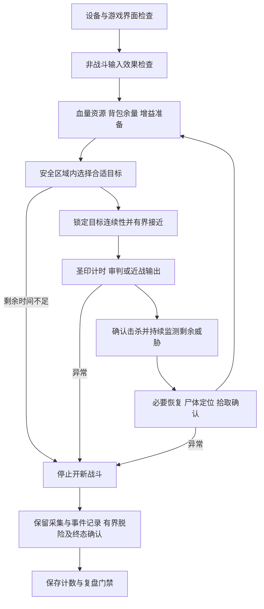

# 圣骑士挂机底层审核与效率改进方案

审核日期：2026年10月7日。范围为当前圣骑士配置、共享运行器、视频与输入链路、识别、目标连续性、战斗、恢复、拾取、退出、计数及近期运行证据。

后续核心修复已实施，当前行为和未实测范围见[修复记录](FOUNDATION_FIXES_20261007.md)。下文保留修复前审核事实，不代表所有问题仍未处理。

当前主要问题是流程之间的证据与状态交接不够可靠，其次是选怪和拾取开销。技能伤害与控制端算力不是现有证据指向的首要瓶颈。建议保留已验证的共享模块，先修事件计数、目标连续性、截止收尾与输入效果检查，再改选怪、拾取和视频采集；不要先全面重写或降低保护阈值。

本次没有发送游戏输入、修改运行参数或解除门禁。完成了源码审核、历史事件统计、三个合成边界探针及308项相关离线回归。最后保存的现场诊断是游戏断线，不代表本次核实了现场仍然断线。当前运行许可文件保持暂停。

## 事实和瓶颈

| 证据 | 结果 | 能得出的结论 |
| --- | --- | --- |
| 最近速率试验04 | 93.37秒，确认击杀发生于70.27秒、87.32秒；不拾取 | 固定分钟窗口为0、2、0、0、0，未通过五分钟验收 |
| 同一轮的阶段耗时 | 不合适目标拒绝38.18秒，巡游18.09秒 | 两者合计56.27秒，占整轮约60.3%；本轮首先应解决有效目标密度和搜索策略 |
| 同一轮429次感知计时 | 取帧中位180.33毫秒、P95 249.14毫秒；核心识别中位4.56毫秒、P95 8.17毫秒 | 慢在截图取得路径，不在核心CV；取帧指标包含归一化处理，不含可独立测量的HDMI源延迟和后台OCR完整耗时 |
| 历史独立拾取 | 文档记录约33秒，130帧、42次输入 | 单次拾取已足以耗尽每只30秒的完整循环预算；新的绝对定位方案尚待实机验证 |
| 历史速率试验02 | 第二次击杀发生在战斗技能失败退出后，约25.95秒；控制器仅报第一只 | 结果归属不能随着技能退出就结束，错误判定和实际击杀要分别记账 |
| 旧死亡事件33 | 约0.53秒帧龄触发停机时，人物仍在战斗、目标43.8%；后续有另一来源受击及死亡文字 | 停止输入不等于人物安全；最后致死间隔缺连续记录，不能声称确切攻击者数量及全部致死原因已经查明 |
| 控制端只读硬件信息 | Apple M5，24GB内存 | 暂无证据支持优先升级Mac；尚未核实游戏PC型号、当前采集卡型号及实际USB总线速率 |

历史串口30次只读版本查询中位约12毫秒，仅证明当时串口查询很快，不能当作游戏按键响应或当前链路性能。四次速率试验合计6只来自独立审计，不能将跨运行补计当作单进程连续成功。

主要证据：[速率报告](../../runs/paladin-rate-20261006-patrol-04/rate-report.json)、[最终复盘](../../runs/paladin-rate-20261006-review-04-final.json)、[累计审计](../../runs/paladin-rate-20261006-progress.json)、[死亡复盘](../../runs/paladin-cv-second-attacker-review.json)、[本次统计及合成探针](../../runs/paladin-audit-20261007/evidence.json)。

## 从输入输出重新梳理逻辑

现有硬件拓扑保持：Windows游戏PC的HDMI画面与USB Audio进入Mac；Mac做本地识别和决策，经KM Box发键鼠。游戏信息仍只来自视频和音频，不引入客户端内存、API、插件或客户端日志。

应明确区分四种事实：

1. **设备连通**：串口可答复、采集源可读。
2. **输入送达控制盒**：命令写入及ACK；不能证明PC接收或游戏执行。
3. **游戏产生预期变化**：背包确实打开、光标确实到位、目标确实受到相关技能作用。
4. **任务结果成立**：击杀证据属于本次交战、拾取有新本人回执、退出经过稳定脱战确认。

这四层失败应使用不同错误码、不同恢复动作，不能都重试同一个按键。圣印保留用户指定的例外：以ACK后的单调时间估算，24秒刷新，约30秒有效期；常规不逐帧识别图标。计时不升级为视觉生效证明。

建议的共享流程如下。框图描述目标结构，不表示已经全部实现。

状态快照与事件需要分开：血量、目标框位置可只保留最新值；经验增加、输入完成、技能效果、死亡疑点等必须有事件ID、来源帧、时间及消费状态。仍由单进程、单输入所有者运行，不需要消息服务器或多控制进程。

## 当前源码的关键问题

以下P1表示先修再扩量；P2表示效率或可维护性问题。合成复现证明指定边界存在，不证明它就是某次历史事故原因。

### 经验事件可能被最新帧覆盖

**P1，源码与合成探针确认。** `Vision.experience_event`比较相邻感知帧，经验从50%升到52%时只产生一次true，下一帧52%就恢复false。`Perception.latest`是单槽快照，`Scheduler._drive`在等待输入、暂停或异步工作时不会逐帧把所有观察交给战斗策略。若恰好跳过变化帧，策略无法补读该事件。

本次调用真实检测函数，输入50%、52%、52%，得到false、true、false；只读首尾帧时事件消失。这是事件交接的结构风险，尚未证明近期哪一次漏计由它造成。

另有已发生的边界：战斗失败后普攻仍可能完成击杀，而安全退出阶段不再由原Policy处理XP。试验02有独立审计确认，说明需要跨技能保留交战记录。当前4到5级回绕有模板，6级及以上未覆盖；仅放宽XP变化阈值不能可靠解决跨级与其他经验来源。

**修复方向**：感知端生成有序、有限容量的事件记录；交战会话在战斗失败后仍保留到安全结算。消费事件时关联攻击时间、目标连续性及本人文字证据；容量溢出显式失败。对无法关联的经验保留“待审计”，不能自动算击杀。应回放消费者跳帧、动作等待中击杀、瞬杀、失败后击杀、升级、重复文字与无关经验。

位置：`vision_state.py:77`、`runtime_engine.py:127`、`runtime_engine.py:490`、`control_policy.py:160`、`runtime_skills.py:211`、`runtime_safety.py:15`。

### 同一怪名的不同模板被视为不同目标

**P1，源码与合成探针确认。** `allowed_target`把最高分模板文件的键名作为`target_label`；`TargetContinuity.update`把这个键名放进身份键。当前`allowed_name_kobold_vermin`与`allowed_name_kobold_vermin_current`都对应狗头人歹徒，但胜出模板变化会令track从1变2，即使血量、校准、场景条件相同。

战中这可能触发`target_changed_under_threat`。这是过度敏感的一面；另一面是同名、相近血量的两个实体仍可能混淆，因为模板名并非游戏实体ID。

**修复方向**：先统一模板到规范怪名，并加入模板切换滞回；实体连续性另外参考目标框、姓名板位置、血量变化和短暂遮挡。不能只把相同怪名全并成一个目标。低置信时保持停止新攻击的原则，不在战中Tab找替代目标。验收必须同时覆盖“同实体模板变亮”和“同名另一实体切入”。

位置：`vision_state.py:120`、`target_continuity.py:8`、`runtime_skills.py:247`、`classes/paladin/vision/profile.json`中的名称别名。

### 总运行期限与安全收尾的语义不一致

**P1，源码和速率试验04确认。** `Controller.run_skill`将每个技能deadline裁剪到整个运行deadline；调度器在技能中到时抛出`skill_deadline`。因此即使怪已死且人物满血，战后静默期也可能被总期限切断。本轮87.32秒已经击杀，随后在90秒边界失败，正是这个结果。

`rate_evidence.py`允许`cancelled/run_deadline`且安全确认的计划停止，却不接受`failed/skill_deadline`。目前同一次计划到时会因恰好处于技能内部或循环间隙而得到不同验收结果。正常completed路径也不统一填写`safety_exit`，而速率工具要求该字段为`peace_confirmed`。

**修复方向**：把“停止开新战斗的时刻”“计量窗口终点”“有界安全收尾终点”明确分开，统一计划结束结果。剩余预算不足时不再开怪；300秒后只允许收尾，不能把收尾击杀补进前五分钟。正常、异常出口都产出同一种终态证据。不得只修改验收器把失败当通过。

位置：`runtime_main.py:284`、`runtime_engine.py:416`、`runtime_engine.py:542`、`runtime_main.py:265`、`rate_evidence.py:58`。

### 游戏输入效果仍缺统一诊断

**P1，历史实机故障已确认，硬件根因未确认。** 先前ESC和B键都有ACK，但目标与背包未变化。当前背包、拾取、进攻技能已有各自效果检查，不能说完全没有闭环；缺的是统一的错误分类与现场定位。

建议用“未写入、已写入未ACK、已ACK效果未知、效果确认、效果矛盾”描述动作。未知结果的拾取不要自动重放；背包等切换键要先识别当前开关状态。启动或设备重连后在脱战条件下完成背包开读关检查，运行期间依靠业务动作效果监测，避免频繁开包充当心跳。

重点排查PC前台、KM到PC的USB连接、电源管理、端口重枚举和鼠标跨屏，不能据ACK快就判链路正常，也不能据失败就判定KM Box损坏。绝对定位需固定所控显示器和坐标映射，并由真实光标验证。

位置：`runtime_engine.py:262`、`kmbox_tap.py`、`run_permission.py`；证据：`runs/paladin-idle-20261006-input-failure-review.json`。

### 画面时效和战斗状态的可信度仍有盲区

**P1，源码边界，未确认发生冻结事故。** 当前时间戳来自截图请求及本地处理，能防本地过期帧，不能证明OBS返回的内容不是上游重复画面。`combat_known`主要根据是否配置战斗ROI生成，也不等于这一帧战斗标志可靠可读。法力OCR未知又会令整张Observation无效，迫使原本可读的血量/目标保护跟着等待或退出。

建议在共享Observation中逐字段保存known、置信度和采集时间，先处理血量和受击，再决定是否允许耗蓝动作。保留输入前0.5秒时效门槛。源活性结合采样时间戳、游戏中自然动态区域及动作预期变化判断；静止画面不能单独判冻结，源时间戳也不能证明游戏在正常运行。

窗口失标的8秒重定位期间不能产生新输入；若已交战，独立安全状态仍要继续记录。采集长期失败必须明确“无法确认安全”，不能把停止进程写成脱战。音频只能触发复核，现有USB Audio链路不等于已验证的受击分类或声源方向。

位置：`vision_feed.py:28`、`runtime_engine.py:93`、`runtime_engine.py:450`、`vision_state.py:227`、`vision_state.py:245`。

### 背包缓存无法跨正常拾取复用

**P2，源码及合成探针确认。** 圣骑士配置TTL为180秒，但每次`inventory_skill('loot',...)`都先invalidate；下一轮仍需重读背包。因此单纯增大TTL并未消除完整循环中的逐次开包。保守失效有合理原因：一次拾取可能占多个槽，堆叠和物品数量不能凭击杀数推断。

更有效的方案是维护“可信空槽下限”：只有经验证的新增物品/槽位证据足够时才能扣减并继续复用；否则保持当前失效。定期完整开包，交易不确定、物品操作未知或余量接近保留槽时立即重读。若没有可靠的单次占槽上界，就不允许只按每只怪减一格。

位置：`runtime_main.py:280`、`runtime_main.py:361`、`workflow_state.py:6`、`classes/paladin/combat.json`。

### 选怪和移动缺少搜索进度记忆

**P2，本轮实机时间占比明确。** 当前主要依靠Tab和左右转向，未知目标最多跳过若干次，再由roam短转向加两次前进；没有成熟的安全区域约束、重复候选记忆和可通行性验证。错怪很多时会反复付出识别成本，盲走也无法保证到达更好的怪群。

先在已批准怪群建立小范围固定路线和边界，再对可见候选按“白名单可信度、距离代理、朝向、附近威胁、最近失败”排序。距离只能称视觉代理，不假定已知精确码数。短期记住刚拒绝的候选和失败位置，但同名多个怪必须区别处理。位置与朝向无法可靠恢复时停止巡游，不提高Tab频率碰运气。

当前接近仍先要求审判的朝向/距离，最多12次短W，再F8启动近战。需要比较“审判拉怪后接近”和“安全短距内F8接近后审判”，不能仅因F8更少按键就全局替换：CTM无避障/区域保证，可能穿过额外怪。

位置：`control_policy.py:193`、`melee_rotation.py:6`、`runtime_skills.py:735`。

### 拾取快路径已实现但尚未证明提速

**P2，历史慢路径确定，新路径待实测。** 已有姓名板尸体线索、绝对光标探测和紧凑聊天回执，不应重复发明一套。下一步优先验证它们能否稳定工作。旧单次约33秒，不能冒称新方案已降到几秒。

尸体线索只有12秒有效期，且场景变化会丢弃；战后静默加恢复可能耗掉这一窗口。不能盲目延长TTL，应该在安全画面下持续跟踪或重定位尸体。完整拾取仍必须有loot光标及新本人回执；`interaction_confirmed`与`corpse_empty_verified`要继续分开，后者目前明确为false。

位置：`workflow_state.py:CorpseHint`、`runtime_skills.py:146`、`runtime_skills.py:629`；方案见[拾取CV记录](LOOT_CV_20261006.md)。

### 安全能力的上限需要明确

**P1，已知能力限制。** 现有威胁监测、战后静默、死亡门禁和失败后持续观察必须保留。自动撤退仍是两次转向和有限前进，没有经验证的避障路线；战中治疗尚未实现。当前模块适用于已验证低风险区域的有界测试，不能据单次击杀成功放行复杂地形或多怪无人值守。

优先建设已知安全区域内的脱险路径、位移停滞检测和有限恢复。战中治疗要单独核实目标选择、施法打断、法力及治疗收益，不能把战后F1加治疗流程直接搬入战斗。零血/不可读保持疑似死亡审查；证据不足时不自动复活续刷。

位置：`runtime_skills.py:470`、`runtime_skills.py:527`、`runtime_safety.py`、`threat_state.py`、`death_review.py`。

## 提升效率的实施顺序

| 顺序 | 工作 | 完成标准 |
| --- | --- | --- |
| 第一阶段 | 事件持久交接、目标模板别名与实体连续性、计划结束及安全收尾统一 | 上述故障回放通过；跳帧不丢事件、重复消费不重计、同名切怪不误继承 |
| 第二阶段 | 固定UI、输入效果诊断、游戏界面与采集源活性分层 | 非战斗小批输入均有可审计效果；失效能明确落到输入、画面或界面层 |
| 第三阶段 | 在批准区域优化选怪和接近；实测现有拾取快路径 | 一次完整找怪、击杀、恢复、拾取、安全结束闭环成功；失败留下可定位阶段 |
| 第四阶段 | 修背包重复检查、测安全范围内的恢复阈值与起手方案 | 对照实测说明节省在哪一阶段；不靠关闭拾取或降低保护获得表面提速 |
| 第五阶段 | 视频流通道对照评测与必要硬件替换 | 识别准确率不下降，帧龄及抖动降低，恢复能力通过断连场景验证 |
| 第六阶段 | 连续小批到五分钟，再进入更长验收 | 五个固定一分钟窗口分别达标、包含终态安全证据；长跑按现有验收要求执行 |

收益先看每小时“完整完成并确认拾取的击杀数”和人工干预次数，再看战斗秒数。死亡、无法确认安全、漏计/重计、输入失效、未确认拾取分别统计，不能揉成成功率。保留“只杀怪不拾取”作为定位战斗瓶颈的实验口径，与完整挂机单独报告。

每分钟两只意味着长期平均每只完整循环要不超过30秒，但平均值达标仍不保证每个固定窗口达标。可先用以下**工程预算而非实测承诺**分配：找怪接近5秒、战斗8秒、战后确认4秒、拾取5秒、摊销准备/背包/恢复3秒、余量5秒。哪项超过预算就针对该项定位。连续恢复较多时必须重新估算，不能强行削减静默期。

圣印继续跨战斗复用24秒计时，重启补挂；审判10.2秒是已有冷却余量，不应靠压缩发送间隔突破。70%开战法力、95%就绪血量属于现有保守参数，后续应依据低级目标的真实消耗、治疗储备和连续伤害分布验证调整，当前不直接下调。

## 视频通道和硬件升级选择

### 先测清延迟再决定采购

当前`GetSourceScreenshot`每帧取得JPEG，经Base64解码再归一化；配置8Hz不等于实际8Hz，更不等于采集卡只支持8帧。最近取帧中位180毫秒，仅该环节已超过125毫秒的8Hz周期。把核心CV从约5毫秒优化到约2毫秒，收益远小于去掉截图链路中的等待。

优先做受控对照：保持相同1080p和UI，对比现有OBS截图与Mac直接读取UVC视频样本。直接采集可用AVFoundation `AVCaptureVideoDataOutput`，用单槽最新图像加独立事件记录，丢弃迟到视频而不丢业务事件。Apple提供逐样本输出及丢帧处理接口；是否能与当前OBS共用设备、是否更快、像素格式是否改变识别，均需现场验证。不能预先承诺延迟减半。[Apple视频输出文档](https://developer.apple.com/documentation/avfoundation/avcapturevideodataoutput)、[Apple丢帧处理说明](https://developer.apple.com/library/archive/technotes/tn2445/_index.html)。

测量分四段：游戏显示到采集样本、样本到结构化观察、动作提议到串口ACK、按键到可见效果。对硬件源延迟可用非游戏测试图案和同步拍摄对照；不要把串口12毫秒或截图180毫秒当端到端值。只读长时观察可先筛出卡顿，但不能验证PC输入链路。

### 采购优先级

| 选项 | 何时值得投入 | 对本项目的判断 |
| --- | --- | --- |
| 合格短USB数据线、HDMI线，采集设备直连合适USB口 | 检出掉线、重枚举或带宽竞争 | 最先排查，成本低；不同插孔不必然是不同控制器；有源Hub解决供电不等于增加带宽 |
| 稳定的1080p60 USB3采集卡 | 当前设备实测源延迟/冻结/USB稳定性不达标，或无法提供合适视频格式 | 最有可能有价值的主要硬件升级；先评测再买，不优先追求4K |
| 独立稳定的HID控制设备或更换现有KM链路部件 | 排除PC前台、电源及线缆问题后仍出现ACK有而游戏无响应 | 重点看有界按键、断连释放、可控绝对/相对坐标；更高轮询率不能替代游戏效果核验 |
| 固定显示拓扑，必要时带EDID保持能力的设备 | 有证据表明显示器休眠/切换导致分辨率或布局重置 | 条件性选项；不能解决游戏断线，也不是此次故障已确认根因 |
| 游戏PC升级 | 实测游戏帧时间抖动、掉帧导致画面/输入不稳定 | 先测PC表现，当前无型号与性能证据，不能指定换CPU或显卡 |
| Mac升级或额外GPU | 本地识别/OCR持续排队并被证实为主瓶颈 | 当前M5/24GB及核心CV耗时不支持优先采购；新增模型后重新测量 |
| UPS或独立音频硬件 | 有实际供电问题，或已验证音频算法受现链路限制 | 低优先级；已有USB Audio，不需要先补一个麦克风 |

可评估的具体采集卡包括 **Magewell USB Capture HDMI Gen 2**：官方列有USB3、1080p60、macOS AVCaptureSession接口和自定义EDID；**Elgato HD60 X**：官方列有Mac支持及1080p60 SDR能力。它们只是待测候选，不代表已经证明比现有设备更低延迟，也不是购买承诺。[Magewell规格](https://www.magewell.com/tech-specs/usb-capture-hdmi-gen-2)、[Elgato系统要求](https://help.elgato.com/hc/en-us/articles/5293623183501-Elgato-Game-Capture-HD60-X-System-Requirements)、[Elgato支持分辨率](https://help.elgato.com/hc/en-us/articles/5293283235469-Elgato-Game-Capture-HD60-X-Supported-Resolutions)。

1080p是当前标定基础，升级到4K会增加像素处理量并引入重标定，未必提高收益。选购应看Mac上的实际采集能力和测试结果，不将HDMI直通的低延迟宣传当作CV读取延迟。

## 验证范围与续测结论

本次运行`run_tests.py --suite combat --suite vision --suite loot --suite core`：308项唯一测试，0失败、0错误、0跳过，用时15.224秒。测试仅证明已有覆盖通过，不覆盖全部上述新增发现；钓鱼、导航等其他组未重跑。报告：[测试记录](../../runs/paladin-audit-20261007-tests.json)。

合成边界探针覆盖单帧XP脉冲、同怪名不同模板导致track改变、拾取后180秒缓存立即失效；它们是问题复现，不是修复验收。[可复现脚本](../../runs/paladin-audit-20261007/offline_probe.py)仅读取历史事件并调用本地函数，不连接设备。

当前没有实现本报告提出的生产逻辑修改。旧死亡审查和运行许可不变；本次审核不能解除暂停。后续实机入口仍需新鲜游戏画面、人物在批准低级怪区域、血量/战斗状态及背包输入效果确认；先单次完整闭环，再有界小批。失败必须回到对应证据层诊断，不能靠反复重启和追加次数证明稳定。

入口文档仍夹有旧19/20和最新20/20叙述，长期应收敛为一份结构化状态加自动摘要，历史记录保留链接。现阶段以最新运行许可、进度和对应复盘为准，不能按某段旧文字续跑。
